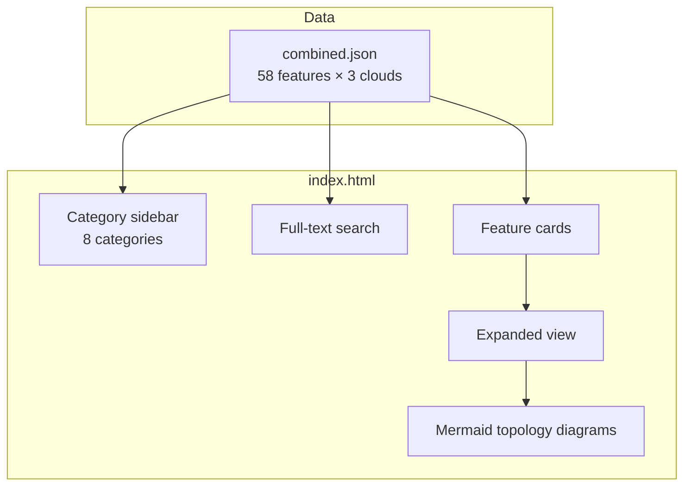

# Cloud Networking Compared

**👉 [Live Site](https://adstuart.github.io/cloud-networking-compared/)**

Side-by-side comparison of 58 networking features across Azure, AWS, and GCP. Browse by category, search by keyword, and expand any feature to see per-cloud descriptions, topology diagrams, key limits, and practitioner notes.

## Architecture

## Categories

| # | Category | Features |
|---|----------|----------|
| 1 | Fundamentals | VNets/VPCs, subnets, public IPs, NSGs, peering, NAT, NICs |
| 2 | Topology | Hub-spoke, managed WAN, route tables, UDRs, connected groups, network manager |
| 3 | Hybrid Connectivity | Site-to-site VPN, P2S VPN, dedicated circuits (direct & partner), MACsec, Global Reach, gateway SKUs |
| 4 | Security | Cloud-native firewalls, DDoS, WAF, bastion, microsegmentation, TLS inspection, firewall policy management, NVA chaining |
| 5 | DNS & PaaS | Private DNS, DNS forwarding, DNS security, Private Link/PrivateLink/PSC, gateway endpoints, cross-tenant connectivity |
| 6 | App Delivery | L4/L7 load balancers, global LB, DNS traffic management, CDN, API gateways, reverse proxy |
| 7 | Monitoring | Flow logs, packet capture, traffic analytics, diagnostics, connection monitoring |
| 8 | Operations & IaC | Infrastructure as Code (Bicep, CloudFormation, Terraform, etc.) |

## Data

All comparison data lives in `data/combined.json`. Each feature includes:
- Per-cloud name, description, and key detail (limits, pricing, SKUs)
- Mermaid topology diagram per cloud
- Cross-cloud architectural differences summary
- Practitioner note with real-world deployment advice
- Documentation URL per cloud

## Contributing

See [CONTRIBUTING.md](CONTRIBUTING.md) for how to report errors or submit corrections.

## License

MIT
